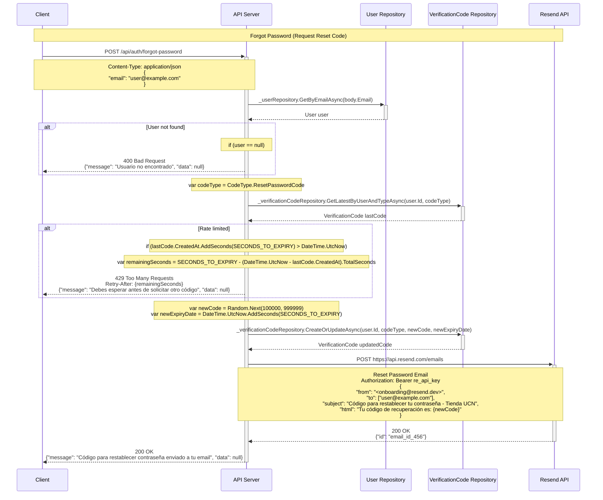

# Flujo Forgot Password (Solicitud de código)

```mermaid
sequenceDiagram
    participant C as Client
    participant API as API Server
    participant UR as User Repository
    participant VCR as VerificationCode Repository
    participant RS as Resend API

    Note over C,RS: Forgot Password (Request Reset Code)

    C->>+API: POST /api/auth/forgot-password
    Note over C,API: Content-Type: application/json<br/>{<br/>"email": "user@example.com"<br/>}

    API->>+UR: _userRepository.GetByEmailAsync(body.Email)
    UR-->>-API: User user

    alt User not found
        Note over API: if (user == null)
        API-->>C: 400 Bad Request<br/>{"message": "Usuario no encontrado", "data": null}
    end

    Note over API: var codeType = CodeType.ResetPasswordCode

    API->>+VCR: _verificationCodeRepository.GetLatestByUserAndTypeAsync(user.Id, codeType)
    VCR-->>-API: VerificationCode lastCode

    alt Rate limited
        Note over API: if (lastCode.CreatedAt.AddSeconds(SECONDS_TO_EXPIRY) > DateTime.UtcNow)
        Note over API: var remainingSeconds = SECONDS_TO_EXPIRY - (DateTime.UtcNow - lastCode.CreatedAt).TotalSeconds

        API-->>C: 429 Too Many Requests<br/>Retry-After: {remainingSeconds}<br/>{"message": "Debes esperar antes de solicitar otro código", "data": null}
    end

    Note over API: var newCode = Random.Next(100000, 999999)<br/>var newExpiryDate = DateTime.UtcNow.AddSeconds(SECONDS_TO_EXPIRY)

    API->>+VCR: _verificationCodeRepository.CreateOrUpdateAsync(user.Id, codeType, newCode, newExpiryDate)
    VCR-->>-API: VerificationCode updatedCode

    API->>+RS: POST https://api.resend.com/emails
    Note over API,RS: Reset Password Email<br/>Authorization: Bearer re_api_key<br/>{<br/>"from": "<onboarding@resend.dev>",<br/>"to": ["user@example.com"],<br/>"subject": "Código para restablecer tu contraseña - Tienda UCN",<br/>"html": "Tu código de recuperación es: {newCode}"<br/>}

    RS-->>-API: 200 OK<br/>{"id": "email_id_456"}

    API-->>-C: 200 OK<br/>{"message": "Código para restablecer contraseña enviado a tu email", "data": null}
```
