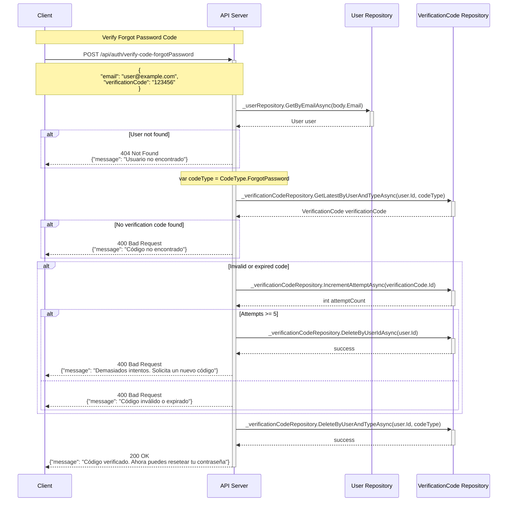

# Verificar código de Forgot Password

```mermaid
sequenceDiagram
    participant C as Client
    participant API as API Server
    participant UR as User Repository
    participant VCR as VerificationCode Repository

    Note over C,API: Verify Forgot Password Code

    C->>+API: POST /api/auth/verify-code-forgotPassword
    Note over C,API: {<br/>"email": "user@example.com",<br/>"verificationCode": "123456"<br/>}

    API->>+UR: _userRepository.GetByEmailAsync(body.Email)
    UR-->>-API: User user

    alt User not found
        API-->>C: 404 Not Found<br/>{"message": "Usuario no encontrado"}
    end

    Note over API: var codeType = CodeType.ForgotPassword

    API->>+VCR: _verificationCodeRepository.GetLatestByUserAndTypeAsync(user.Id, codeType)
    VCR-->>-API: VerificationCode verificationCode

    alt No verification code found
        API-->>C: 400 Bad Request<br/>{"message": "Código no encontrado"}
    end

    alt Invalid or expired code
        API->>+VCR: _verificationCodeRepository.IncrementAttemptAsync(verificationCode.Id)
        VCR-->>-API: int attemptCount

        alt Attempts >= 5
            API->>+VCR: _verificationCodeRepository.DeleteByUserIdAsync(user.Id)
            VCR-->>-API: success
            API-->>C: 400 Bad Request<br/>{"message": "Demasiados intentos. Solicita un nuevo código"}
        else
            API-->>C: 400 Bad Request<br/>{"message": "Código inválido o expirado"}
        end
    end

    API->>+VCR: _verificationCodeRepository.DeleteByUserAndTypeAsync(user.Id, codeType)
    VCR-->>-API: success

    API-->>-C: 200 OK<br/>{"message": "Código verificado. Ahora puedes resetear tu contraseña"}
```